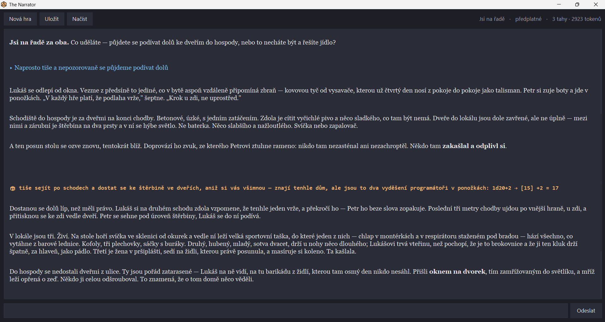
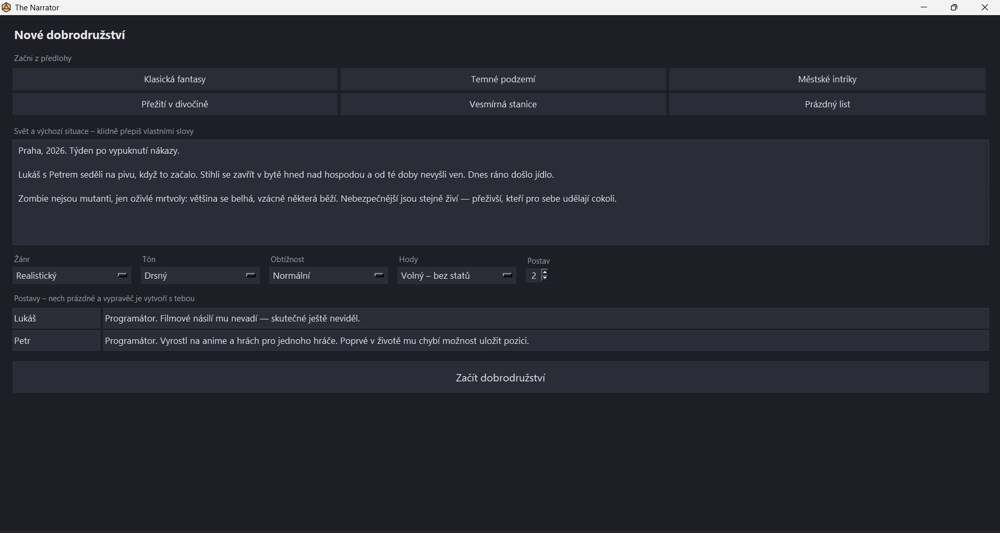
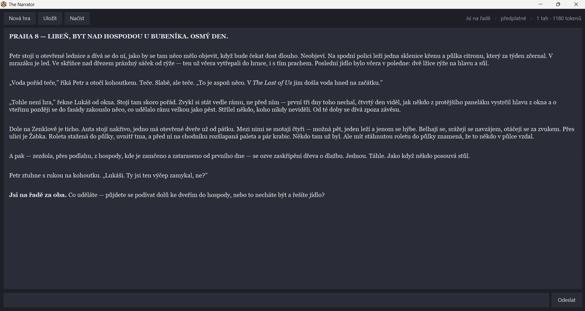

# The Narrator

By Miroslav Kalenský.

A single-player tabletop RPG in a desktop window, where Claude is the game master and
the program rolls the dice so no outcome is ever invented by the model.

The game is played in Czech: every prompt, label and piece of narration.
The code, comments and tests are English.

*Built with AI assistance (Claude Code).*

The amber line is very important part of the project. The narrator asked for that roll, then the
program rolled it and handed back a number the model could not choose. The status bar
on the top right corner counts what the game has cost so far.

## Game mechanics

You describe a world in your own words, for example *"Prague 2026, a week into a zombie outbreak"*,
pick a genre, tone, difficulty and dice system, name your characters, and play by
typing what you do. The narrator answers in prose and asks the program for a roll
whenever the outcome is uncertain.

Three sentences of setup become the opening scene. Nobody wrote the jar of horseradish,
the half a lemon gone black, or the sound of a table being moved in the pub downstairs.
The narrator was given the situation and filled in the rest.

## Running it

Requires **Windows** and **Python 3.9+** by syntax, built and tested on 3.13. Tkinter
ships with the standard installer, and nothing else is needed to open the game.

    "The Narrator.pyw"            double-click, no console window
    python -m game.gui            the same window, with a console for tracebacks
    python -m game.console        terminal-only version
    python tests/run_all.py       the tests

### Two ways to pay for the tokens

| | subscription | API credit |
|---|---|---|
| needs | [Claude Code](https://claude.com/claude-code) (`npm install -g @anthropic-ai/claude-code`) | `pip install anthropic` + `ANTHROPIC_API_KEY` |
| module | `game/engine_claude_code.py` | `game/engine_api.py` |

`gui.BACKEND` decides: `"auto"` (the default) tries the subscription first and falls
back to the API key. Both expose the same `narrator_turn(...)`, so the window cannot
tell them apart, and neither dependency is required for the other path.

The subscription path drives Anthropic's own Claude Code CLI in its documented
[headless mode](https://code.claude.com/docs/en/headless) (`claude -p` with
`--output-format stream-json`). Each player authenticates with their own account, and
no credentials ship with the project.

## Revealed and solved problems

**The model must not be able to fake a roll.** Asking it nicely does not hold up over a
long game. The constraint is structural instead: on the API path it can only get a
number by calling a tool, and on the subscription path it writes a marker

    [HOD: 1d20+3 | útok mečem]

which `MarkerFilter` intercepts *before the text reaches the screen*. The program rolls
and sends the number back as a fact (that is the amber line in the screenshot at the
top), the marker that produced it never appeared. In an early version the narrator wrote
`k20 → 17 + 5 = 22` into the prose and quietly decided its own fights.

**Text arrives in chunks, and markers get split across them.** A roll marker can turn
up as `[HOD: 1d2` … `0+5 | útok` … ` mečem]`, and the same is true of `**bold**` in the
markdown renderer. Both hold text back from the first ambiguous character until its
meaning is settled. The tests replay every case at 300 random chunk sizes, because the
failure mode is a marker flashing on screen for one frame.

**The narrator kept leaving the world it was given.** Told to run present-day Prague, it
opened three games in a row somewhere else for example a medieval hall, an alien forest, an
office across town. The cause was in the prompt: the base persona said "on the
lines of Dungeons & Dragons", which quietly outvoted the setting. Removing that, adding
a genre as the first line of the brief and repeating the place in the *last* sentence
the model reads fixed it. Measured, not guessed: genre held, and dice rolls went from 0
to 5 per four turns.

**Every turn is counted, and that is what caught the worst regression.** The status bar
shows the running cost while you play, and the two engines count different things
because they are billed differently:

| | `Costs` (API) | `SubscriptionCosts` (Claude Code) |
|---|---|---|
| shows | `$0.041` | `5 tahů · 8430 tokenů` |
| tracks | input, output, cache writes, cache reads | turns, input, output, cache reads |
| because | credit is spent per token, at four different rates | a subscription has no per-token price, so turns and output are the honest proxy |

Cache reads are counted apart from fresh input on purpose: they cost a tenth as much
(`$0.50` against `$5.00` per million), and a game re-sends the whole story every turn,
so most input is a cache hit. Lumping them together would overstate a session's price
by roughly an order of magnitude.

The payoff was not the number itself. After a rules change meant to make the narrator
resolve things promptly, the counter jumped from `5 tahů · 5419 tokenů` to
`24 tahů · 40317 tokenů` for the same four turns. The narrator had started chaining
dice rolls, one round trip each, and turns had quietly gone from 60 seconds to over
four minutes. The prose looked fine but the counter did not. Capping rolls at two per turn
put it back.

Both classes expose the same `add(usage)` and `status_text()`, so the window renders
whichever it was handed without knowing which kind of cost it is looking at.

**Windows caps a command line at 8191 characters.** The subscription engine passes its
system prompt to `claude` as an argument, and as the rules grew the game stopped
starting at all saying `The command line is too long.`, before a single word of the story.
The world brief now travels through the pipe in the first message, the fixed part is
checked at startup and fails loudly if it ever grows past the limit again.

## Layout

Everything the player touches sits at the top, the code lives one level down.

    The Narrator.pyw           what you double-click
    rules/                     the narrator's house rules, editable prose
    saves/                     saved games
    assets/                    the icon
    game/                      the code
    tests/

### game/

    gui.py                  the window: setup screen, story, background thread, queue
    console.py              terminal front-end
    engine_claude_code.py   narrator via the `claude` CLI, paid from a subscription
    engine_api.py           narrator via the Anthropic SDK, paid from API credit
    world.py                Settings, the four option enums, presets, the brief
    rules_loader.py         loads rules/*.md into the prompt
    prompts.py              narrator persona + dice rules shared by both engines
    dice.py                 notation parsing and rolling
    storage.py              save/load into saves/, plain JSON only
    markdown_stream.py      streamed markdown -> styled spans for the text widget

## Tuning the narrator without touching code

`rules/*.md` are plain prose read at the start of every game, can be edited in a text
editor. The number in the filename sets the order.

    rules/10-svet.md        stay inside the world, genre and place that were set
    rules/15-postavy.md     characters keep the skills the player gave them
    rules/20-tah.md         resolve something every turn, how much to roll and write

When the narrator misbehaves, this is the first place to look, not the model.

## How a game is described

`world.Settings` is one dataclass holding everything a game is set up with, and the
only place that clamps values. The four closed choices are enums whose members carry
all three faces of an option at once:

    Genre.FANTASY.key           "fantasy"        what the save file stores
    Genre.FANTASY.label         "Fantasy"        what the dropdown shows
    Genre.FANTASY.description   "Fantasy. ..."   what the narrator is told

Adding a genre is one line, the window builds its dropdown from `Genre.labels()` and
cannot drift out of sync. Unknown keys raise rather than falling back. A preset with a
typo used to produce a quietly wrong world.

## Tests

    python tests/run_all.py              everything -- 327 checks
    python tests/run_all.py --headless   the 265 that need no desktop

No tokens are spent: the engines are faked and the window runs against a stand-in.
Three of the ten files open real Tk windows, so `--headless` skips them, that is what
CI runs on every push, and it still covers the dice, the world, the markdown stream,
the cost counters, the Claude Code engine and saving.

`test_without_anthropic.py` runs a second interpreter with the package blocked, to
prove a subscription-only player can still start the game.

## Limitations

- **Windows only.** DPI handling, the `claude.cmd` lookup and the `.ico` are all
  Windows-specific, the rest is portable.
- The dollar figure is an estimate: the per-million prices are constants in
  `engine_api.py` and go stale whenever Anthropic changes them.
- `gui.py` is 670 lines and wants splitting, the story view is the natural seam.
- No type hints. CI covers the two thirds of the suite that needs no desktop,
  the window tests are run by hand.
- A turn takes 50–100 seconds, most of it waiting for the model.
